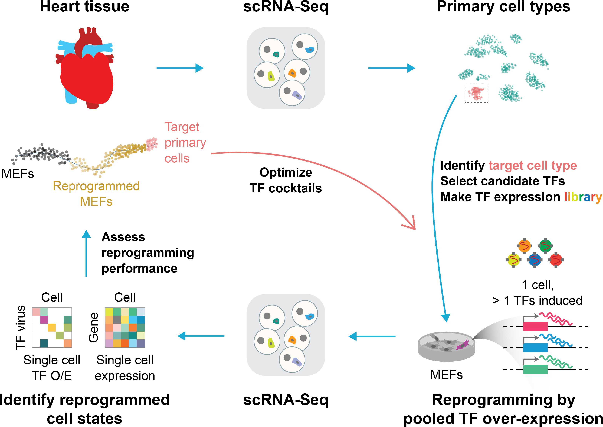

# Reprogram-Seq

Reprogram-Seq leverages organ-specific cell atlas data with single-cell perturbation and computational analysis to predict, evaluate, and optimize TF combinations that reprogram a cell type of interest.

---
&nbsp;
## Reprogram-Seq workflow
&nbsp;


&nbsp;

## File organization
```
.
├── README.md
├── analyses
│   ├── cluster_10x_data.R
│   ├── cluster_drop-seq_data.R
│   ├── construct_trajectories.R
│   └── permute_pca_irlba.R
├── data
│   ├── 10x
│   │   ├── epicardial_10f_d7
│   │   │   └── tsne_out_coords.rds
│   │   ├── epicardial_3f_d7
│   │   │   ├── cell_dataset_lowerDetectionLimit0.5_DDRTree_dim2_reverse.rds
│   │   │   └── de_paired_primary_epicardial_uninfected.rds
│   │   ├── expr_readcount_raw_csc_dimnames.rds
│   │   ├── expr_readcount_raw_csc_indices_part1.rds
│   │   ├── expr_readcount_raw_csc_indices_part2.rds
│   │   ├── expr_readcount_raw_csc_indptr.rds
│   │   ├── expr_readcount_raw_csc_shape.rds
│   │   └── expr_readcount_raw_csc_values.rds
│   ├── drop-seq
│   │   ├── expr_readcount_raw_csc_dimnames.rds
│   │   ├── expr_readcount_raw_csc_indices.rds
│   │   ├── expr_readcount_raw_csc_indptr.rds
│   │   ├── expr_readcount_raw_csc_shape.rds
│   │   ├── expr_readcount_raw_csc_values.rds
│   │   └── tsne_out_coords.rds
│   └── misc
│       ├── genes.tsv
│       └── workflow.png
├── notebooks
│   ├── jupyter_notebooks
│   │   ├── cluster_scanpy.ipynb
│   │   └── cluster_seurat.html
│   └── rmarkdown_notebooks
│       ├── README.md
│       ├── global_reprogramming_of_transcription.html
│       ├── rational_epicardial_reprogramming.html
│       └── unbiased_reprogramming.html
└── pipelines
    ├── 10x.sh
    └── drop-seq.sh
```

&nbsp;
## Notebooks

### HTML documents created from R Markdown (to recreate figures)<br/>
[Unbiased reprogramming (4.3 Mb)](http://htmlpreview.github.com/?https://github.com/jlduan/Reprogram-Seq/blob/master/notebooks/rmarkdown_notebooks/unbiased_reprogramming.html)<br/>
[Rational epicardial reprogramming (2.9 Mb)](http://htmlpreview.github.com/?https://github.com/jlduan/Reprogram-Seq/blob/master/notebooks/rmarkdown_notebooks/rational_epicardial_reprogramming.html)<br/>
[Global reprogramming of transcription (5.0 Mb)](http://htmlpreview.github.com/?https://github.com/jlduan/Reprogram-Seq/blob/master/notebooks/rmarkdown_notebooks/global_reprogramming_of_transcription.html)<br/>


### Jupyter & R notebooks (experimenting)<br/>
[Clustering (Scanpy)](https://nbviewer.jupyter.org/github/jlduan/Reprogram-Seq/blob/master/notebooks/jupyter_notebooks/cluster_scanpy.ipynb)<br/>
[Clustering (Seurat)](https://htmlpreview.github.io/?https://github.com/jlduan/Reprogram-Seq/blob/master/notebooks/jupyter_notebooks/cluster_seurat.html)<br/>
...
&nbsp;
## How to cite<br/>

Jialei Duan, Boxun Li, Minoti Bhakta, Shiqi Xie, Pei Zhou, Nikhil V. Munshi, Gary C. Hon (2019). **Rational Reprogramming of Cellular States by Combinatorial Perturbation.** Cell Rep. 27, 3486–3499.e6.<br/>
DOI: <http://dx.doi.org/10.1016/j.celrep.2019.05.079><br/>
